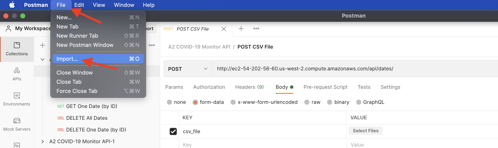
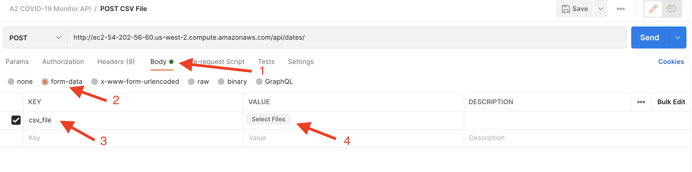
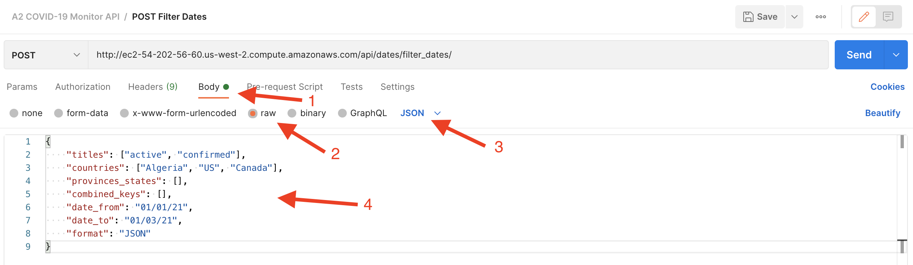

# COVID-19 Monitor Video Presentation
* Frontend (desktop) video presentation: https://youtu.be/82D2FRRec7g
* REST API (with Postman) video presentation: https://youtu.be/iqx924Rw4tM

# COVID-19 Monitor Additional Features

* Frontend: http://ec2-54-202-56-60.us-west-2.compute.amazonaws.com/
* Additional API functionality:
    * GET all dates
    * GET one date (by ID)
    * DELETE all dates
    * DELETE one date (by ID)

# Guidelines for Manual Testing
COVID-19 Monitor app can be manually tested either with [Postman](https://www.postman.com/) or with the frontend: http://ec2-54-202-56-60.us-west-2.compute.amazonaws.com/

To learn more about testing the app with the frontend (desktop only) please watch the [frontend video presentation](https://youtu.be/82D2FRRec7g) (sound on!).
The frontend is communicating with the backend and database via the API.

Please note that the csvs you upload must be one of the four types specified in the assignment handout or a bad request error will be returned. Note that if some row has non integer values for the deaths/confirmed cases/active cases etc then instead of returning an error our program will simply skip that single input. 

To manually test the API directly please use Postman - please see instructions below.

## Guidelines for Manual Testing with Postman
1. Download the Postman collection `A2_COVID19_Monitor_API.postman_collection.json` from A2 top directory.
2. Install [Postman](https://www.postman.com/).
3. Import COVID-19 Monitor API collection into Postman (`File` >> `Import` >> Upload `A2_COVID19_Monitor_API.postman_collection.json`)

4. Please watch the [video presentation](https://youtu.be/iqx924Rw4tM) (sound on!) to see how each of the API calls works.
5. Please review the REST API Documentation section below.
6. To upload a CSV file please use `Body` >> `form-data` in Postman.

7. To query data please use `Body` >> `raw` >> `JSON` in Postman.


# REST API Documentation

* **Upload CSV File**
    - Request Method: POST
    - Request URL: `http://ec2-54-202-56-60.us-west-2.compute.amazonaws.com/api/dates/`
    - Body (FILES): 
        * Key: `csv_file` 
        * Value: Upload CSV file
    - Response Status: 
        * Success: 201
        * Failure - Bad Request: 400

* **Filter and retrieve dates**
    - Request Method: POST
    - Request URL: `http://ec2-54-202-56-60.us-west-2.compute.amazonaws.com/api/dates/filter_dates/`
    - Body (data) - Request JSON format examples:
        * Filter by titles ("active", "confirmed", "deaths", "recovered"), countries ("Algeria", "US", "Canada"), and time period from January 1, 2021 to January 3, 2021 (3 days). Returns a paginated list of JSONs.
        ```
        {
            "titles": ["active", "confirmed", "deaths", "recovered"],
            "countries": ["Algeria", "US", "Canada"],
            "provinces_states": [],
            "combined_keys": [],
            "date_from": "01/01/21",
            "date_to": "01/03/21",
            "format": "JSON"
        }
        ```
        * Filter by titles ("active"), combined keys ("Clay, Alabama, US", "Coffee, Alabama, US", "Yakutat, Alaska, US"), and time period from January 1, 2021 to January 1, 2021 (1 day). Returns a paginated list of JSONs.
        ```
        {
            "titles": ["active"],
            "countries": [],
            "provinces_states": [],
            "combined_keys": ["Clay, Alabama, US", "Coffee, Alabama, US", "Yakutat, Alaska, US"],
            "date_from": "01/01/21",
            "date_to": "01/01/21",
            "format": "JSON"
        }
        ```
        * Filter by provinces/states ("Alabama", "Illinois"). Returns a CSV.
        ```
        {
            "titles": [],
            "countries": [],
            "provinces_states": ["Alabama", "Illinois"],
            "combined_keys": [],
            "date_from": "",
            "date_to": "",
            "format": "CSV"
        }
        ```
        * Leave all filters empty. Returns a CSV with all the dates stored in the database.
        ```
        {
            "titles": [],
            "countries": [],
            "provinces_states": [],
            "combined_keys": [],
            "date_from": "",
            "date_to": "",
            "format": "CSV"
        }
        ```      
    - Response Status: 
        * Success: 200
        * Failure - Bad Request: 400
        
* **Retrieve All Dates (without filter)**
    - Request Method: GET
    - Request URL: `http://ec2-54-202-56-60.us-west-2.compute.amazonaws.com/api/dates/`
    - No body
    - Response Status: 
        * Success: 200

* **Retrieve One Date (by ID)**
    - Request Method: GET
    - Request URL: `http://ec2-54-202-56-60.us-west-2.compute.amazonaws.com/api/dates/{ID}/`
    - No body
    - Response Status: 
        * Success: 200
        * Failure - Not Found: 404
        
* **Delete All Dates**
    - Request Method: DELETE
    - Request URL: `http://ec2-54-202-56-60.us-west-2.compute.amazonaws.com/api/dates/delete_all_dates/`
    - No body
    - Response Status: 
        * Success: 200
        
* **Delete One Date (by ID)**
    - Request Method: DELETE
    - Request URL: `http://ec2-54-202-56-60.us-west-2.compute.amazonaws.com/api/dates/{ID}/`
    - No body
    - Response Status: 
        * Success: 204
        * Failure - Not Found: 404

# Pair Programming 
### Procedure
To kickstart our workflow we decided to start the assignment using pair programming over Zoom. In our first session on Monday (01/11/21) we first scanned the project requirements and discussed ideas. We continued to setup
our API project using Django and SQLite. Also, we implemented the models required to store the information read from the csv files and started work on the create function found in views.py to pass this data. During this
first session Natalia served as the driver actively writing code and Robin as the navigator responsible for reviewing code. 

On Tuesday (02/11/21) we inverted our approach and had Robin become the driver and Natalia the navigator. During this session the team continued work on the create method and began work on verifying csv files to check if
they followed one of the four formats from the GitHub on the assignment handout. To end the session, we held a brief discussion on how to efficiently divide tasks between ourselves. 

Starting from Wednesday (03/11/21) team members started to work on their designated tasks individually. When stuck or a major milestone was achieved that required the other's attention, we hosted more pair programming sessions. 
For instance, once one of us finished the basic unit testing functionality we had a quick meeting in which that person would be the navigator and explain to the driver how to implement tests for their code. Of course, the driver in
this scenario would write one or two tests while being guided by the supervisor. 


As you can see on the image of the commit activity below we only had one or two commits during our first to pair programming sessions but significantly more as we branched off to work individually using pair programming
only when needing help or when in a scenario as described previously. 


### Reflection
Some of the pros of pair programming include:
* By starting the assignment using a pair programming setup we easily established a common ground. That means, both team members were aware of the basic structures underlying the project (such as the models) before branching
off to start working individually. Clearly, this was extremely useful as no partner felt as though they were working with black box algorithms.

* By being in a voice chat during sessions we were also able to divide work between ourselves, establish expectations or bounce ideas off each other. For instance, while a driver was writing code to verify csv files the navigator
was able to think about the design. This made us move the csv verification code out of the views.py (where it did not belong) or use inheritance as a design principle when implementing the DailyWriter and SeriesWriter classes.

* By reconvening when milestones were met, we were able to save time as the team member who was not responsible for that milestone was quickly introduced to it and guided through it using a pair programming format. 

* One advantage of doing pair programming via Zoom was that we were able to save commute time. Also, by using screen sharing we always had a clear view of the driver's code which may not have been the case if we had to share a screen
in an in-person session.

Some of the cons include:
* Sometimes there were unforeseen circumstances with software related issues. For example, to use a Django server configuration in PyCharm one must own the professional licence. As one of us did not have this, some time
was lost when the navigator had to wait until this was resolved. 

* Pair programming required both partners to find a suitable time of day in which they can team up. Since both of us have busy schedules, this led to logistic challenges.

All in all, our team felt that pair programing was a positive experience and helped us save time. This could have been even more evident if logistic challenges could have been avoided.  

# Tests
88% Coverage. Please see the results of running tests with coverage in [GitHub Actions logs](https://github.com/csc301-fall-2021/assignment-2-1-robingerster-nataliamoran/runs/4131366172?check_suite_focus=true#step:7:210).
* Tests GitHub path: https://github.com/csc301-fall-2021/assignment-2-1-robingerster-nataliamoran/blob/main/backend/covidmonitor/tests.py
* Tests tech stack: [Django Unit Test framework](https://docs.djangoproject.com/en/3.2/topics/testing/tools/)
* Unit test name convention: MethodName_StateUnderTest_ExpectedBehavior
* Unit test structure:
    * arrange
    * act
    * assert
    
# Program Design
## Data Transfer Object and Data Access Object Design
To abstract the details of an underlying data store we used Data Transfer Object and Data Access Object design patterns.
Data Transfer Object is represented in Django as [Model](https://docs.djangoproject.com/en/3.2/topics/db/models/), and Data Access Object is represented in Django as [Manager](https://docs.djangoproject.com/en/3.2/topics/db/managers/).

To store data we designed [CovidMonitorDate model](https://github.com/csc301-fall-2021/assignment-2-1-robingerster-nataliamoran/blob/main/backend/covidmonitor/models.py):
```
    title = models.CharField(max_length=255)
    date = models.DateField()
    country = models.CharField(max_length=255)
    province_state = models.CharField(max_length=255, blank=True, null=True)
    combined_key = models.CharField(max_length=255, blank=True, null=True)
    number = models.IntegerField()
    created_at = models.DateTimeField(auto_now_add=True)
    updated_at = models.DateTimeField(auto_now=True)
    internal_combined_key = models.CharField(max_length=1000)
```
To access this model we used the Manager `objects` ([please see an example here](https://github.com/csc301-fall-2021/assignment-2-1-robingerster-nataliamoran/blob/main/backend/covidmonitor/views.py#L36)).

This design helped us to keep the data persistent. Also, this allows the COVID-19 Monitor app to not be dependent on a specific data store:
currently, the app is using SQLite3 DB, but it is possible to change the database technology (e.g. start using PostgreSQL) if needed.

## Data Storage
Because the structure of available data is known in advance 
(e.g. each date has a case title ("active", "confirmed", "deaths", or "recovered"), country, number of cases, etc), 
to store the data we chose the relational database SQLite3. 

The advantage of SQLite3 is its simplicity: it is easy to install and manage. 
During the development process whenever the database became corrupted, we simply deleted its current instance and created a new one.

The disadvantage of SQLite3 is that this database does not support parallel access: only one thread can use SQLite3 at a given moment. 
Because some CSV files contain thousands and thousands of dates, introducing multithreading for processing a CSV file would speed up 
COVID-19 Monitor app performance, but in this case SQLite3 would become a bottleneck.

## CSV Verifier and Writer Classes
To improve code cohesion, we decided to move the csv verification code out of the views.py script and give it its own class. Likewise, we decided to move the code responsible for reading the csv and passing the data to Django
into a separate file. Here we also decided to use inheritance as both the DailyWriter and SeriesWriter classes share common elements. It should be noted that despite creating more classes our current project showcases very loose
coupling. This is because there is a minimal amount of information flow between classes given that each of them performs independent jobs.

## REST API Design

Frontend communicates with the backend via the REST API.

* `create` API ([GitHub Path](https://github.com/csc301-fall-2021/assignment-2-1-robingerster-nataliamoran/blob/main/backend/covidmonitor/views.py#L66))
    * Method: POST

`create` API uses `request.FILES` to receive a CSV file. We made this design decision based on the potential usage of the Covid Monitor app:
the premier user of this app is a TA who will be testing our assignment. We wanted to make the API user-friendly and assumed that it is 
easier and faster to upload a CSV file (with Postman or frontend) rather than to copy contents of a CSV file into the request body (e.g. `request.data`).

Under different circumstances we might have had chosen to use `request.data`: 
if we were building an API interface for other APIs to communicate with, using `request.data` would have more sense
because then we could assume that the CSV content is already extracted from the CSV file by other entities (e.g. other APIs) and
the interaction with a human would not need to be taken into consideration.     

* `filter_dates` API ([GitHub Path](https://github.com/csc301-fall-2021/assignment-2-1-robingerster-nataliamoran/blob/main/backend/covidmonitor/views.py#L84))
    * Method: POST
    
`filter_dates` API receives a JSON and returns a JSON or a CSV, depending on the request. 
To not make the API interface unnecessary complicated, we decided to create one API call for both returning 
a JSON or a CSV instead of separating this call into two calls with different response format. 
If the Covid Monitor app would ever grow or be used by other applications, this design would have to be re-thought.
